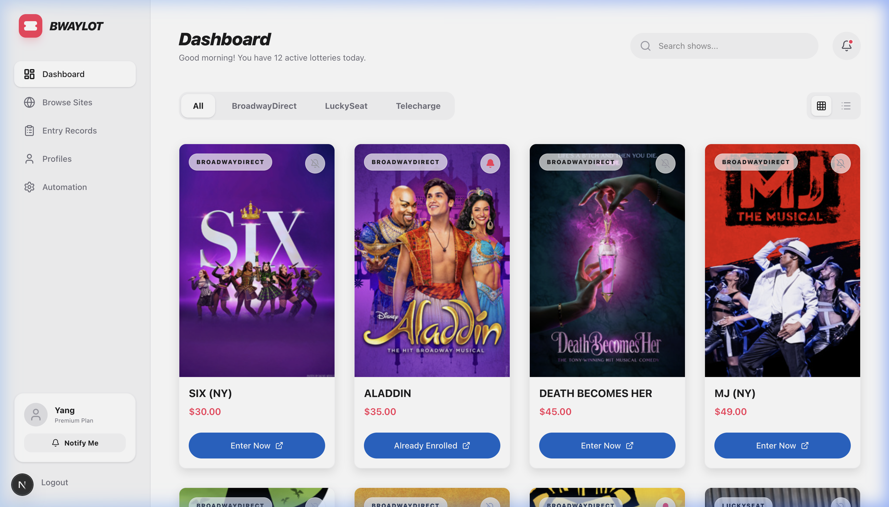
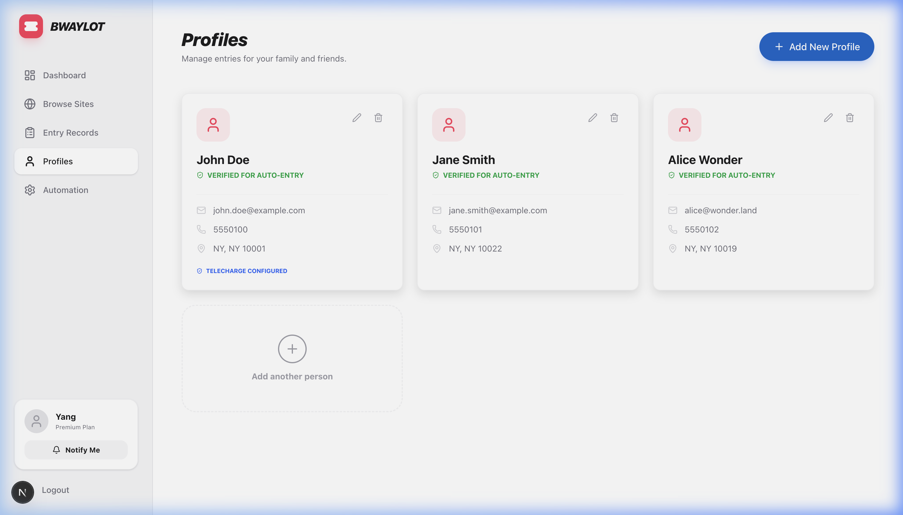
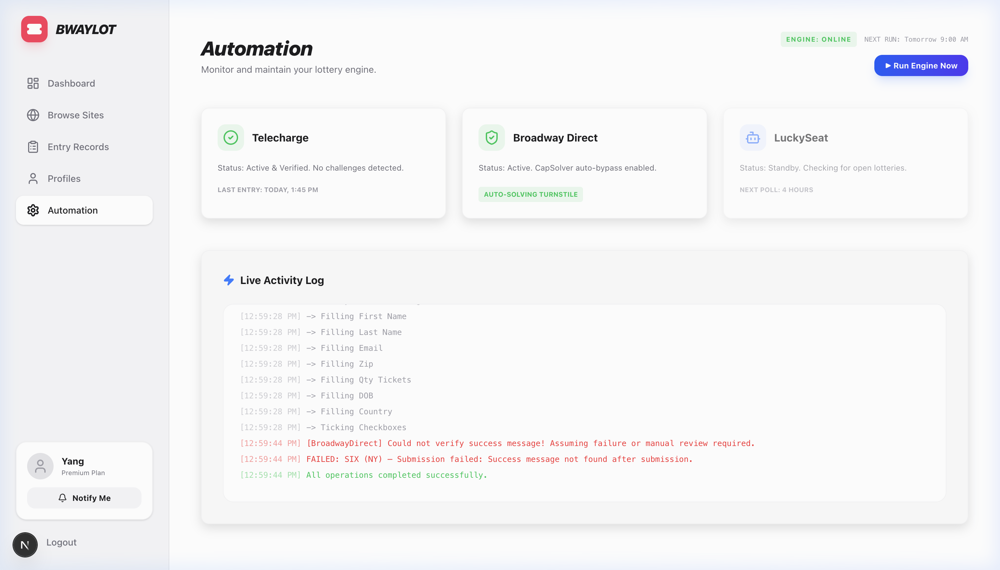

# Broadway Lottery Automation Tool 🎭

A high-performance, stealthy automation suite for Broadway Direct, Lucky Seat, and Telecharge lotteries. Built with Next.js, Playwright, and CapSolver.



## ✨ Features

- **Multi-Site Support**: Broadway Direct, Lucky Seat, and Telecharge (via SocialToaster).
- **Multi-Profile Management**: Enter lotteries for yourself, your family, and your friends with a single click.
- **Smart Automation**: Detects and enters multiple performances (Matinee/Evening) automatically.
- **Stealthy & Safe**: Built-in Turnstile solving and persistent session management.

<div align="center">
  
  
</div>

## 🚀 Terminal Walkthrough

To run this project locally on your machine, follow these steps:

### 1. Prerequisites
Ensure you have **Node.js 18+** installed. You will also need a **CapSolver API Key** and **SMTP credentials** for email notifications (if using).

### 2. Installation
```bash
# Install dependencies
npm install

# Install Playwright browsers
npx playwright install chromium
```

### 3. Configuration
Create a `.env.local` file in the root directory:
```env
CAPSOLVER_API_KEY=your_key_here
EMAIL_USER=your_email@gmail.com
EMAIL_PASS=your_app_password
```

### 4. Running the App
```bash
# Start the Next.js development server
npm run dev
```
Open [http://localhost:3000](http://localhost:3000) to manage profiles and view lotteries.

### 5. Manual CLI Testing
To run a specific automation test from the terminal:
```bash
npx ts-node src/test-real-entry-tc.ts
```

## 🛠️ Project "Memory"
For a detailed history of the technical journey, decisions, and collaborative milestones, see [project_history.md](./project_history.md).

## 📅 Future Roadmap (TBD)
Based on our technical evaluation, the next steps for public deployment are:
1. **Supabase Integration**: Move from local JSON storage to Supabase PostgreSQL with Auth + RLS.
2. **GCP Automation Worker**: Migrate Playwright logic to a Google Cloud Run container or Compute Engine VM using GCP credits.
3. **Residential Proxies**: Integrate proxy rotation to avoid IP-based bot detection on cloud servers.
4. **Multi-User Dashboard**: A public-facing UI where friends can securely managed their own credentials.

---
*Developed with love for Broadway fans.*
